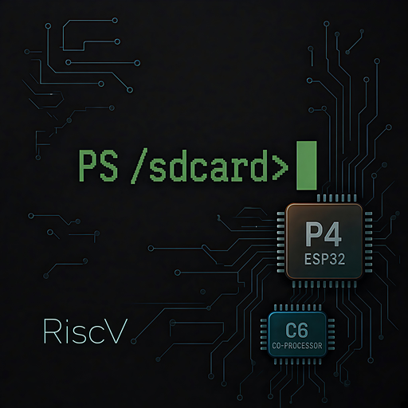
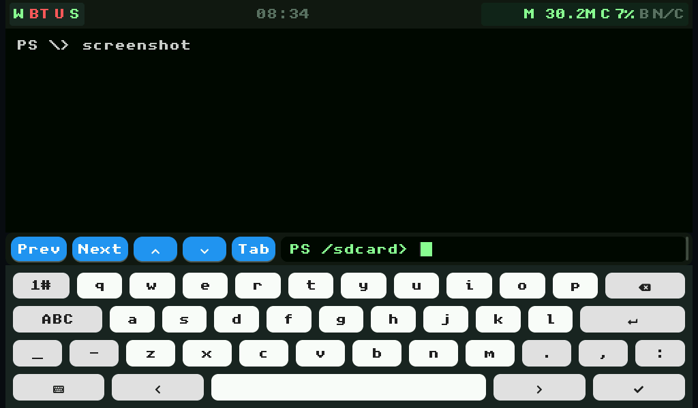
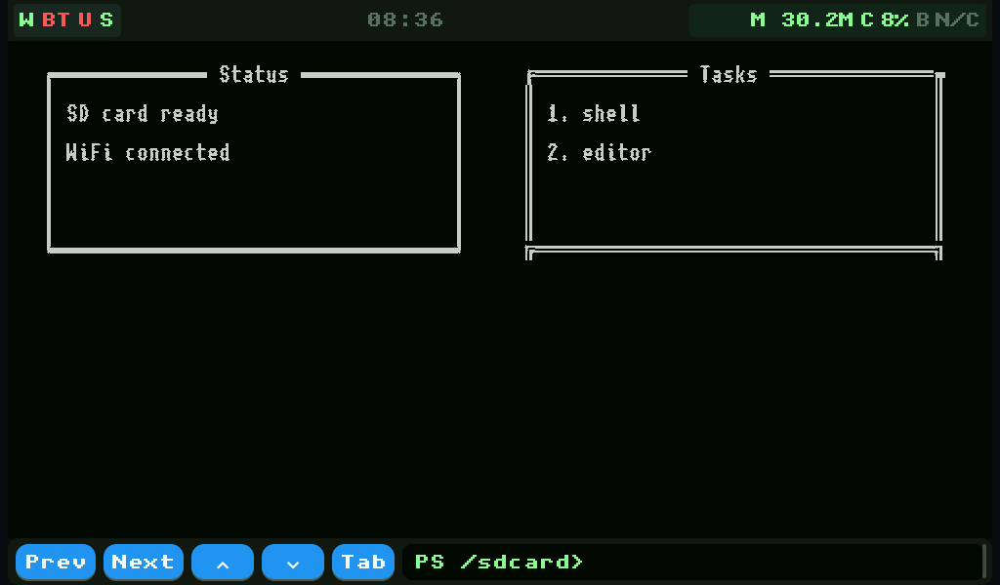
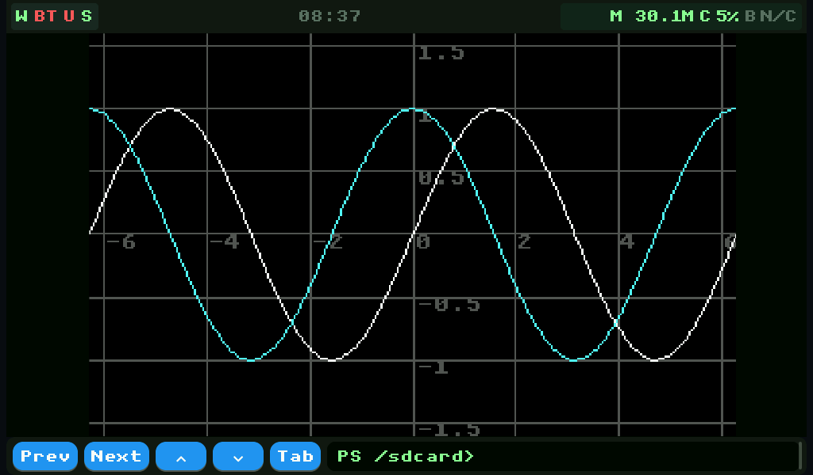
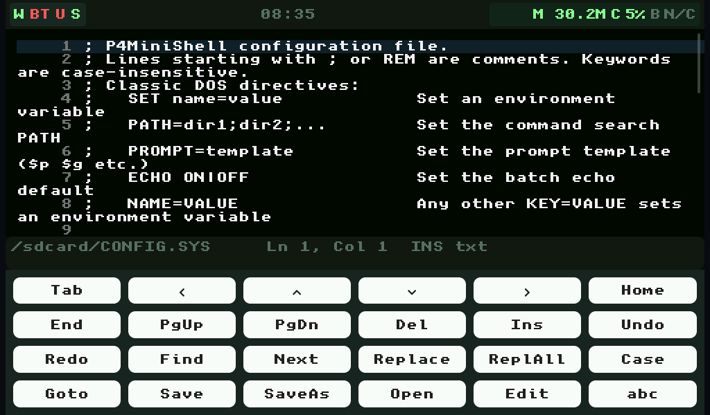

# P4MiniShell



**A modular shell and application framework for ESP32-P4 handhelds.**

P4MiniShell turns an ESP32-P4 board with an ESP32-C6 radio into a small,
self-contained computer: a persistent command shell, a real batch-file
language, an SD-card application ecosystem, a native C app SDK, and a
display/TUI/GFX stack you can build on.

**Version:** 1.2.0 · **Target:** ESP32-P4 + ESP32-C6 (ESP-Hosted SDIO) · **Display:** JD9165 1024x600 MIPI-DSI · **License:** MIT

| Shell | TUI apps |
|---|---|
|  |  |
| Plot graphs | Text editor |
|  |  |

All screenshots are captured live from the device over USB serial
(`python tools/capture_docs.py <COM_PORT>`); the full set is in
[`docs/assets/`](docs/assets/README.md).

---

## What is P4MiniShell?

P4MiniShell is not a single app. It is a **software framework for building
palmtops, PDAs, writerdecks, and similar handheld devices** on the ESP32-P4.
It provides the parts such devices share:

- a **touch-first shell** with history, completion, and a serial console bridge;
- a **DOS-style batch language** (variables, `if`/`for`/`goto`/`call`/`gosub`/`on`,
  pipes, redirection, aliases, error levels) that runs from the SD card;
- an **application model** where a `.bat` file *is* an app, plus a **native C
  SDK** (`applib`) for the polished surfaces batch cannot draw;
- shared **UI surfaces**: modals (`dialog`, `list`, `ask`, `browse`, `view`,
  `hexview`), an `edit` text editor, an 80x25 TUI cell buffer, and an RGB565
  `gfx` canvas with docs, sprites, and a plot/graph layer;
- **data and state** primitives: a Palm-OS-style record store (`db`), CSV/JSON
  handling, INI settings, alarms/calendar, encryption, and backups;
- **connectivity**: hosted Wi-Fi, BLE, USB host (storage/keyboard/mouse/serial),
  an HTTP file server, and C6 firmware OTA;
- a **hardware abstraction** (display, touch, keyboard, audio, status LED,
  battery, power) already wired for the ESP32-P4 Function EV Board class.

Everything is driven by one central config (`p4minishell_config.h` + its YAML
twin) and one contract for extending it (`SDK.md`).

The shell is intentionally DOS-shaped (`dir`, `copy`, `set`, `if`, `for`) but
it is a modern embedded implementation: colour output, tab completion,
background jobs, and a C app ABI included.

---

## Current state (v1.2.0)

This is the first public release. The firmware is hardware-verified on the
ESP32-P4 Function EV Board (JC1060P470C, JD9165 panel, GT911 touch, SD card)
and on the M5Stack Tab5 (ILI9881C/ST7123 720x1280 DSI, ES8388 audio, hosted C6
Wi-Fi + BLE, Tab5Keyboard input with two independent RGB LEDs, INA226 pack
gauge with charging, RX8130CE RTC, BMI270 IMU with tilt auto-rotate, and an
SC202CS MIPI-CSI camera that captures BMP stills); the on-board unit suite plus
the host regression runners are green. See
[`test/README.md`](test/README.md) for the current unit-test count and
[`tools/README.md`](tools/README.md) for the hardware drivers.

**Implemented and verified**

- **Shell:** transcript with ANSI colour on screen and serial, scrollback,
  command history with SD save/restore, tab + ghost completion, reverse search,
  a flexible `prompt` template, and a worker task so heavy commands never stall
  the UI.
- **Filesystem:** DOS file verbs (`cd dir copy move del ren md rd type write
  append touch`), full `dir` switch set, `xcopy`, `attrib`, `label`, a recycle
  bin (`undelete`/`trash`), `chkdsk`, `format`, and `disk` partition tools.
- **Batch:** `set`/`set /a`/`set /p`, `calc` (floating point + BASIC-style
  math/string functions), `if`, `for`, `for /f`, `goto`, `call`/`gosub`
  (local and shared-library routines with `return`), `on … goto|gosub`
  computed dispatch, `alias`, `bind`, `macro`, `start`/`taskkill`
  background jobs, `dialog`/`list`/`ask` modals, and `exit /b`.
- **Apps:** PATH + `sd:/APPS` discovery with `APPINFO` metadata, `pkg`
  install/remove from CRC-checked bundles, asset manifests (`asset`), and the
  `applib` native-app runtime.
- **Data:** `db` record store, `csv` grid + `=EXPR` evaluation, `export`/`import`
  interchange, `archive`/`backup`, `crypt` (AES-256-GCM), `ini`/`appconfig`/`temp`.
- **Display:** `draw` TUI verbs, `gfx` RGB565 canvas with sprites and images,
  `plot` graphs, `font` registry with SD TTFs and CJK fallback, and UI themes.
- **Connectivity:** hosted Wi-Fi (station + known-network list), BLE,
  `ping`/`dns`/`httpget`/`tcpterm`, `httpd` file server, `netstat`/`ipconfig`,
  USB host (MSC, HID, CDC-ACM `usb userial`), and C6 OTA.
- **Hardware:** brightness/rotation, battery telemetry, audio (`beep`/`tone`/
  `wavplay`), WS2812 status LED, GPIO/PWM/ADC/I2C toolkit, idle display-off,
  and sleep/deep-sleep.
- **Editor:** a touch-first, PSRAM-backed `edit` editor for any SD text file.
- **Writerdeck:** focus/typewriter mode (`edit /focus`, live word count),
  document templates (`sd:/TEMPLATES/`, push with
  `python apps/push_templates.py <COM_PORT>`), proportional/serif *reading*
  typography for `view`/preview (vendored `DejaVuSerif`, push with
  `python push_fonts.py <COM_PORT>`), offline spelling underlines from an SD
  wordlist (`sd:/DICTS/`, push the `apps/dicts/` sample with
  `python apps/push_dicts.py <COM_PORT>`), and
  `markdown export <src> <out> [text|html|print]` (plain text, a standalone
  HTML reader page, or a paginated print layout) for sharing over `httpd`.
  Nothing above is turnkey: each SD payload must be pushed once (see
  [SD card layout](#4-sd-card-layout) and
  [Deploy the reference apps](#5-deploy-the-reference-apps)); missing pieces
  fall back visibly (bitmap font, `Spell` stays off, empty template buffer).

Reference apps that ship in `apps/`: `companion` (a pure-batch system helper),
`tcmd` (dual-pane commander), `snake`, `elite`, `adventure`, `notes`, `mood`,
`gfxdemo` (`BOUNCE`, `GFXTOOL`, `PLOT`), `pics`, and `diag` (system health,
capability and frame-rate diagnostics).

> **Build constraints.** The LVGL sample applications are excluded from the
> build to fit the image budget. Wi-Fi is station-only (SoftAP is compiled
> out). Logging is warn-level. ESP-Hosted resets the C6 on every host boot.

---

## Quick start

### 1. Prerequisites

- [ESP-IDF **v5.5.5**](https://docs.espressif.com/projects/esp-idf/) and the
  `esp32p4` toolchain.
- An ESP32-P4 board with a MIPI-DSI display and touch — the ESP32-P4 Function
  EV Board / JC1060P470C (JD9165 1024x600 + GT911) is the reference, and the
  M5Stack Tab5 (ILI9881C/ST7123 720x1280, ES8388, Tab5Keyboard) is also
  supported (`-DP4_BOARD=m5stack_tab5`, see [`PORTING.md`](PORTING.md) §6) — an
  ESP32-C6 co-processor on the SDIO link, and a FAT32 microSD card.
- Python 3 with `pyserial` (and `opencv-python` for the camera diagnostics) to
  run the host tools.

### 2. Build and flash

```powershell
# Source ESP-IDF (adjust the path to your install)
$env:IDF_PATH = "<path-to-esp-idf-v5.5.5>"
. $env:IDF_PATH\export.ps1

# From the repository root:
idf.py build
idf.py -p <COM_PORT> flash monitor
```

Replace `<COM_PORT>` with your board's serial port (e.g. `COM3` on Windows,
`/dev/ttyACM0` on Linux). Host tools accept the port as a trailing argument
or via the `P4_PORT` environment variable.

Use the **app image** for C6 OTA updates (not the merged flash image).

### 3. First boot

On first boot with an SD card inserted, the firmware creates minimal
`CONFIG.SYS` and `AUTOEXEC.BAT` files (with commented defaults), shows an
"SD card ready" welcome, and opens the prompt. Without a card it boots in a
degraded, in-memory mode and tells you why.

Type `help` for the command summary, or `help /all` for the full offline
reference. `about` prints the build identity and license.

### 4. SD card layout

| Path | Purpose |
|------|---------|
| `CONFIG.SYS` | Boot directives (Wi-Fi, display, UI, GPIO, `LAUNCH_APP=`) |
| `AUTOEXEC.BAT` | Boot batch script |
| `APPS/` | Installed app metadata (`<APP>.APPINFO`, `<APP>.ASSETS`) |
| `PKGS/<APP>/` | Installable package bundles for `pkg install` |
| `DBS/` | `db` record stores (`DBS/<name>.DB/`) |
| `ALARMS/` | Persisted alarms and calendar events |
| `FONTS/` | Optional SD TrueType fonts (`font set`); the vendored reading serif (`DejaVuSerif`) is pushed by `push_fonts.py` and auto-selected for `view`/preview |
| `TEMPLATES/` | Writerdeck new-file seeds (`edit <file> /template <name>`); pushed by `apps/push_templates.py` |
| `DICTS/` | Writerdeck spell wordlists (`<name>.words`, default `en`); the `apps/dicts/` sample is pushed by `apps/push_dicts.py`; without one `Spell` stays off |
| `WIFI.KNOWN` | Saved Wi-Fi networks |
| `HISTORY.TXT`, `ALIASES.BAT`, `BIND.BAT`, `SHELL.INI` | Persistent shell state |

Put an app's entry `.bat` on `PATH` or under `sd:/APPS`. Run `launch` to see
the discovered apps in a menu, or `launch <name>` to run one directly.

### 5. Deploy the reference apps

Host tools in `apps/` push files to the card over serial
(replace `<COM_PORT>` with your port, or set `P4_PORT`):

```powershell
python apps/companion/push_sd.py <COM_PORT>   # the Companion app
python apps/push_apps.py <COM_PORT>           # tcmd/snake/elite/adventure/...
python apps/push_assets.py <COM_PORT>         # demo BMP sprites + manifests
python apps/push_pkgs.py <COM_PORT>           # build + push PKGS/ bundles
python push_fonts.py <COM_PORT>               # optional SD fonts (incl. the reading serif)
python apps/push_templates.py <COM_PORT>      # writerdeck document templates -> sd:/TEMPLATES/
python apps/push_dicts.py <COM_PORT>          # writerdeck spell wordlists -> sd:/DICTS/
```

Then, at the shell prompt: `launch COMPANION`, `tcmd`, `snake`, `bounce`, and
so on. Install a package with `pkg install <app>` and remove it with
`pkg remove <app>`.

### 6. Test it

```powershell
python tools/unit_run.py <COM_PORT>     # on-board unit suite (Unity)
python tools/regression.py <COM_PORT>   # host regression (apps, modals, gfx, ...)
```

`tools/regression.py` resets the board and runs every host-side suite and
guard, printing a PASS/FAIL table with a non-zero exit on failure.

---

## Feature tour

### Shell, input, and output

- Colour-coded output everywhere: ANSI SGR on the LVGL transcript (per-span
  colours) and raw escape sequences on the serial console, from one palette in
  `components/ansi/ansi_palette.h`.
- Scrollback that jumps to the newest output; scroll by touch, the input-row
  `Up`/`Dn` buttons, USB keyboard `PageUp`/`PageDown`, or the mouse wheel.
- Command history (32 entries, Up/Down, `Ctrl+R` reverse search) saved to
  `HISTORY.TXT`; tab and ghost completion for commands, aliases, and paths;
  `history /save` `/load` `/search` `/clear`.
- A configurable `prompt` template (`$p $g $t $d $v $n` …) driving both the
  serial console and the on-screen input line.
- Serial bridge: `idf.py monitor` is an interactive shell endpoint.

### Files, volumes, and storage guardrails

- DOS file verbs with wildcards, `dir /W /P /S /B /L /A /O`, `xcopy` (full DOS
  switch set), `attrib`, `label`, `tree`, `fc`, `comp`, `sort`, `find`,
  `findstr`, `more`, `csv`, `json`, `markdown`.
- Recycle bin: `del`/`rd /s` move to `.trash`; `undelete`/`trash restore`
  recover; `trash list|info|purge|empty` manage it.
- `chkdsk`, `format` (exact confirmation word), and `disk list|detail|clean|
  create partition|delete partition|format`.
- Free-space prechecks on every write, self-copy protection, and atomic writes.

### Batch language (the app runtime)

- `set`, `set /a` (full COMMAND.COM operator set), `set /p` (prompted and
  file/pipe input), `^` line continuation.
- `calc` floating-point calculator with the FX-870P/VX-4 style math and string
  functions, angle modes, hex, and environment-variable results.
- `if` (errorlevel / exist / defined / numeric keywords / `/i`), `for`,
  `for /f`, `goto`, `call`, `gosub`/`return`/`on` (BASIC control flow), and
  `call <file.bat>::<routine>` shared libraries.
- Multi-stage pipes, `<`/`>`/`>>` redirection, `&`/`&&`/`||` chaining, and
  quote/escape rules shared by one scanner.
- `alias`/`unalias`, `bind` (F-keys and Ctrl-chords), `macro` recorder,
  `delay`, `start`/`taskkill` background jobs, and a foreground break
  (`Ctrl+C` / the Stop button).

### Apps and data

- **Apps are batch files.** Path/`APPS` discovery, `APPINFO` metadata, and the
  `launch` menu.
- **`pkg`** installs apps from CRC-checked `PKGS/<APP>/` bundles; **`asset`**
  verifies asset manifests; **`crc32`** hashes files.
- **`db`** — a Palm-OS-style record store (records, categories, secret fields,
  `db /field:`/`/sort:`), with `export`/`import` to CSV/JSON/TXT/VCF/ICS.
- **`alarm`/`cal`** — persisted events with recurrence and a background checker
  that can run a `/run:` batch file.
- **`archive`/`backup`** — USTAR `.p4a` backups with CRC manifests.
- **`crypt`** — AES-256-GCM + PBKDF2 file encryption.
- **Native app SDK (`applib`)** — transcript stdout (so `myapp > out.txt`
  works), PSRAM-aware allocation, time/input/state helpers, Wi-Fi accessors,
  and the native-app ABI (`app_register`).

### Display, TUI, and graphics

- **`draw`** TUI verbs (box/line/fill/text/bar/table/list/window/cursor/hold/
  fullscreen) over an 80x25 cell grid that maps to the live transcript region.
- **`gfx`** — an RGB565 canvas with pixel/line/rect/circle/polygon/fill/text,
  BMP load/save, 8 sprite slots (up to 64x64) for batch games, and
  firmware-measured frame pacing (`gfx stats`: frames/min/avg/max/jitter/
  dropped/fps).
- **`plot`** — world-coordinate graphs (`func`/`polar`/`para`/`data`/`bar`/
  `table`) sampling `calc` expressions onto the canvas or the TUI.
- **`font`** registry (roles/sizes/fallbacks), SD TTF loading, CJK fallback,
  and **`theme`** (default/amber/ice/mono, live-switchable and persisted).
- An `edit` editor for any SD text file (see [tutorial_edit.md](tutorial_edit.md)).

### Connectivity and hardware

- Hosted Wi-Fi on the C6 (station-only) with a known-network list, `wifi scan`
  and rich `wifi status`, plus `ping`, `dns`, `httpget`, and `tcpterm`.
- An SD **HTTP file server** (`httpd`), `netstat`, and `ipconfig`.
- Hosted BLE (scan/advertise), USB host MSC/HID/CDC-ACM, and C6 OTA.
- Brightness/rotation, battery, audio, status LED(s), GPIO/PWM/ADC/I2C, and
  power management (idle display-off, sleep, deep-sleep, and `shutdown`).
- Status LED(s): a single WS2812 on the EV board, or the two **independently
  addressable** keyboard LEDs on the Tab5 (`rgb 1|2 <r> <g> <b>`; LED1 = status,
  LED2 = user).
- **Battery:** EV = ADC divider; Tab5 = INA226 pack gauge (read-only measurement)
  with charging enabled at boot and an honest `charging`/`discharging`/`idle`/
  `full` state.
- **IMU** (`imu`): Tab5 BMI270 accel/gyro + orientation, opt-in tilt auto-rotate,
  and `IMU_*` environment variables for batch.
- **Camera** (`camera`): Tab5 SC202CS MIPI-CSI still capture to 24-bit BMP.
- `shutdown`/`poweroff`: flush, darken the LEDs, and cut board power (PMIC latch
  on the Tab5, deep sleep on the EV board).
- The on-screen keyboard auto-hides whenever **any** physical keyboard is present
  (USB HID, a connected Bluetooth HID keyboard, or the Tab5 keyboard).

A responsive status header shows Wi-Fi, battery, Bluetooth, USB, SD, memory,
CPU, and the clock, with a notification queue and adaptive refresh; the Wi-Fi
indicator color follows the connection/signal state (and stays green when
associated even if the hosted path cannot report an RSSI).

---

## Architecture

Dependencies flow one way:

```
main -> command -> batch -> storage -> shell -> (ansi, display, windows,
                                                header, keyboard, clock)
```

The only upward dependencies are inverted through registration tables
(`shell_command_ops_t`, `batch_command_ops_t`, `applib_*_ops_t`), so the shell
core and batch engine never include the command layer. Modal surfaces share one
runtime (`components/modal/`). All tunables live in `p4minishell_config.h`
(documented in `p4minishell_config.yaml`); board pins live in
`boards/<name>/board_config.h` (from the matching `.yaml`; default
`boards/jc1060p470c/`, with `boards/m5stack_tab5/` also shipped).

See [documentation.md](documentation.md) for the full module map and
[SDK.md](SDK.md) for how to extend the system.

---

## Hardware baseline

The JC1060P470C reference profile (the M5Stack Tab5 profile is summarised in
[`PORTING.md`](PORTING.md) §6):

| Component | Detail |
|-----------|--------|
| **Host MCU** | ESP32-P4 (rev 1, dual core) |
| **Co-processor** | ESP32-C6 over ESP-Hosted SDIO |
| **Display** | JD9165 1024x600 MIPI-DSI via LVGL 9.5.0 (esp_lvgl_port 2.9.0) |
| **Touch** | GT911 via I2C |
| **Storage** | FATFS on SD with long-filename support (255 chars) |
| **Audio** | ES8311 codec via I2S |
| **Battery** | ADC on GPIO53 with a 2:1 divider |
| **RGB LED** | WS2812 status LED on GPIO26 |
| **Hosted SDIO** | CLK=18 CMD=19 D0=14 D1=15 D2=16 D3=17, reset GPIO54 |
| **USB Host** | MSC at `/usb0` + HID keyboard/mouse + CDC-ACM serial |
| **ESP-IDF** | v5.5.5 |

Other panels are supported by the vendored BSP drivers (ILI9881C, EK79007,
LT8912B); porting to a new board is a documented roadmap item.

---

## Configuration

All tunable values are in `p4minishell_config.h`, grouped by subsystem. The
companion `p4minishell_config.yaml` documents each value (type, meaning,
range). Edit the header, then keep the YAML in sync. Hardware pins and display
timing live in `boards/<name>/board_config.h` / `.yaml` (default
`boards/jc1060p470c/`, selected by `-DP4_BOARD=`); build options live in
`sdkconfig` (generated — edit via `idf.py menuconfig`, the committed source
of truth is `sdkconfig.defaults`). Adding a board is documented in
[`PORTING.md`](PORTING.md).

> **Fresh checkout:** `dependencies.lock` may contain absolute paths from the
> machine that last ran the component manager. If a build complains about
> missing component paths, delete `dependencies.lock` (and
> `test/dependencies.lock`) and run `idf.py update-dependencies`, then
> re-apply the vendored patches with
> `powershell -File tools/reapply_managed_patches.ps1` (see
> `tools/README.md`). `build/`, `test/build/`, `sdkconfig`, `screenshots/`,
> `spikes/`, and `assets_out/` are all local-only and git-ignored.

---

## Documentation

| File | Purpose |
|------|---------|
| [readme.md](readme.md) | This overview and quick start |
| [tutorial_getting_started.md](tutorial_getting_started.md) | Guided first run |
| [tutorial_batch.md](tutorial_batch.md) | Write and package a batch app |
| [tutorial_native.md](tutorial_native.md) | Write a native `applib` app |
| [tutorial_edit.md](tutorial_edit.md) | Complete `edit` editor guide |
| [editor.md](editor.md) | `edit` quick reference |
| [command.md](command.md) | Complete command reference |
| [documentation.md](documentation.md) | Technical architecture |
| [SDK.md](SDK.md) | Integration guide for extending the system |
| [API.md](API.md) | Public module API reference |
| [roadmap.md](roadmap.md) | Feature history and future direction |
| [changelog.md](changelog.md) | Version history |
| [bugs.md](bugs.md) | Bug campaign template and known quirks |
| [ai-context.md](ai-context.md) | Working rules for AI-assisted development |
| [licence.md](licence.md) | MIT license + third-party notices |
| [SECURITY.md](SECURITY.md) | Security policy: device lock, secrets, httpd auth |
| [test/README.md](test/README.md) | Unit-test layout and how to run them |
| [tools/README.md](tools/README.md) | Host-side drivers and hardware tests |
| [PORTING.md](PORTING.md) | Board profiles (`boards/`) and bring-up checklist |
| [docs/native_packaging.md](docs/native_packaging.md) | Native-app package spec (store-only in v1.1) |
| [docs/assets/README.md](docs/assets/README.md) | Public screenshot set + capture guide |

> **Screenshots:** curated public captures live in `docs/assets/` (see its
> README for the naming convention and the build-mode capture commands).
> `screenshots/` at the repo root is git-ignored test scratch and is
> intentionally empty here.

---

## Testing

- **Unit tests:** Unity suites in `test/` run on the P4 target
  (`python tools/unit_run.py COM3`; non-zero exit on any failure).
- **Hardware suites:** `python tools/p4test_run.py COM3` runs the shared
  `tools/p4test/` framework over `tools/suites/` (smoke, storage, batch, data,
  display, editor, input/UI, connectivity, power/audio, performance, apps) and
  prints a PASS/FAIL table. `python tools/regression.py COM3` remains as the
  legacy host regression.
- **Dogfooding:** `python tools/dogfood.py COM3 --minutes 15` autonomously
  drives the board like a curious user, screenshots every action, and journals
  anomalies (panics, timeouts, "BSOD" frames, heap decline).
- **Camera diagnostics:** `tools/display_glitch_watch.py` and
  `tools/led_watch.py` watch the panel and the status LED with a webcam.

See [bugs.md](bugs.md) for the reporting template and [ai-context.md](ai-context.md)
for the change/verification rules.

---

## License

P4MiniShell is released under the **MIT License**. See [LICENSE](LICENSE) and
[licence.md](licence.md). Third-party components (ESP-IDF, LVGL, ESP-Hosted,
FreeRTOS, lwIP, FatFs, mbedTLS, and others) remain under their own licenses;
the full list and terms are in [licence.md](licence.md).
